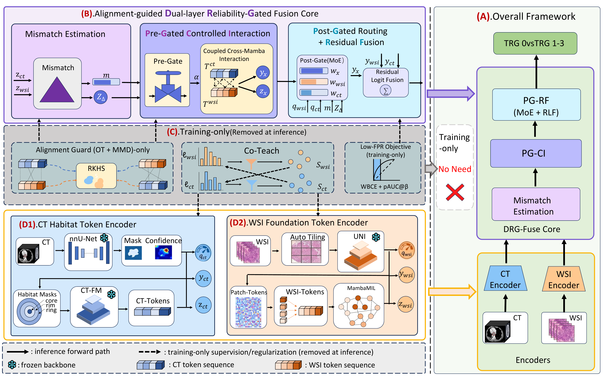

# DRGFuse (Anonymized Code Snapshot)

This repository is a **clean, anonymized, reproducible code snapshot** prepared for **double-blind review**.
It contains the **fusion-side implementation** of **DRGFuse**, along with:
- a **toy (synthetic) dataset** for an end-to-end sanity check,
- **training / evaluation / inference scripts**,
- the **paper tables** and **visualization figures** (exported as metadata-free images).

**Important:** The real multi-center cohort is **not publicly released** due to privacy constraints.
Therefore, this snapshot focuses on **feature-level fusion** (pre-extracted CT/WSI representations).

---

## Method flowchart



---

## What is included (review checklist)

1. **Method flowchart**  
   - `assets/figures/fig1_overview.png`

2. **Code tree**  
   - See below.

3. **Dataset description + split principle**  
   - `DATA.md`

4. **Training procedure (hyperparameters + commands)**  
   - `REPRODUCIBILITY.md`  
   - `scripts/train.py`, `configs/*.yaml`

5. **Inference code + inference example**  
   - `scripts/infer.py` (single-sample inference)  
   - `checkpoints/toy_model.pt` (toy checkpoint)  
   - `data/example/` (toy sample features)

6. **Experimental results tables (from the manuscript)**  
   - `assets/tables/table1.tex`, `assets/tables/table2.tex`, `assets/tables/table3.tex`  
   - `assets/tables/supplementary/*.md`

7. **Visualization results**  
   - `assets/figures/fig2_routing.png`  
   - (optional) reproduce toy routing plots: `scripts/plot_routing_analysis.py`

8. **Example inference data**  
   - `data/example/metadata.csv` + `data/example/features/*.npz`

9. **A model checkpoint that inference can load**  
   - `checkpoints/toy_model.pt` (trained only on synthetic toy data)

---

## Code tree

```text
DRGFuse_anon/
├── assets
│   ├── figures
│   │   ├── fig1_overview.png
│   │   └── fig2_routing.png
│   └── tables
│       ├── supplementary
│       │   ├── calibration_ct.md
│       │   ├── calibration_fusion.md
│       │   └── calibration_wsi.md
│       ├── table1.tex
│       ├── table2.tex
│       └── table3.tex
├── checkpoints
│   ├── README.md
│   └── toy_model.pt
├── configs
│   ├── template.yaml
│   └── toy.yaml
├── data
│   └── example
│       ├── features
│       │   ├── S0001.npz
│       │   ├── S0002.npz
│       │   ├── S0003.npz
│       │   ├── S0004.npz
│       │   ├── S0005.npz
│       │   ├── S0006.npz
│       │   ├── S0007.npz
│       │   ├── S0008.npz
│       │   ├── S0009.npz
│       │   ├── S0010.npz
│       │   ├── S0011.npz
│       │   ├── S0012.npz
│       │   └── ...
│       └── metadata.csv
├── scripts
│   ├── eval.py
│   ├── infer.py
│   ├── make_toy_data.py
│   ├── plot_routing_analysis.py
│   ├── prepare_ct_features_template.py
│   ├── prepare_wsi_features_template.py
│   ├── sanitize_scan.py
│   └── train.py
├── src
│   └── drgfuse
│       ├── models
│       │   ├── __init__.py
│       │   └── fusion.py
│       ├── __init__.py
│       ├── data.py
│       ├── losses.py
│       ├── metrics.py
│       └── utils.py
├── .gitignore
├── DATA.md
├── environment.yml
├── LICENSE
├── pyproject.toml
├── README.md
├── REPRODUCIBILITY.md
└── requirements.txt
```

---

## Quick start (toy demo)

Create environment:

```bash
conda env create -f environment.yml
conda activate drgfuse
pip install -e .
```

Generate toy data:

```bash
python scripts/make_toy_data.py --out_root data/example --seed 0
```

Train:

```bash
python scripts/train.py --config configs/toy.yaml
```

Evaluate (use the best checkpoint path printed by training):

```bash
python scripts/eval.py --config configs/toy.yaml --checkpoint <PATH_TO_BEST_PT>
```

Single-sample inference:

```bash
python scripts/infer.py --checkpoint checkpoints/toy_model.pt --data_root data/example --sample_id S0001
```

---

## Anonymization notes

- No raw clinical data, training logs, caches, or large weights are included.
- This snapshot contains **no `.git` history** and no CI configuration (`.github/` is excluded).
- Run a final scan before pushing:

```bash
python scripts/sanitize_scan.py --root . --fail_on_findings
```

For additional details, see `REPRODUCIBILITY.md`.
